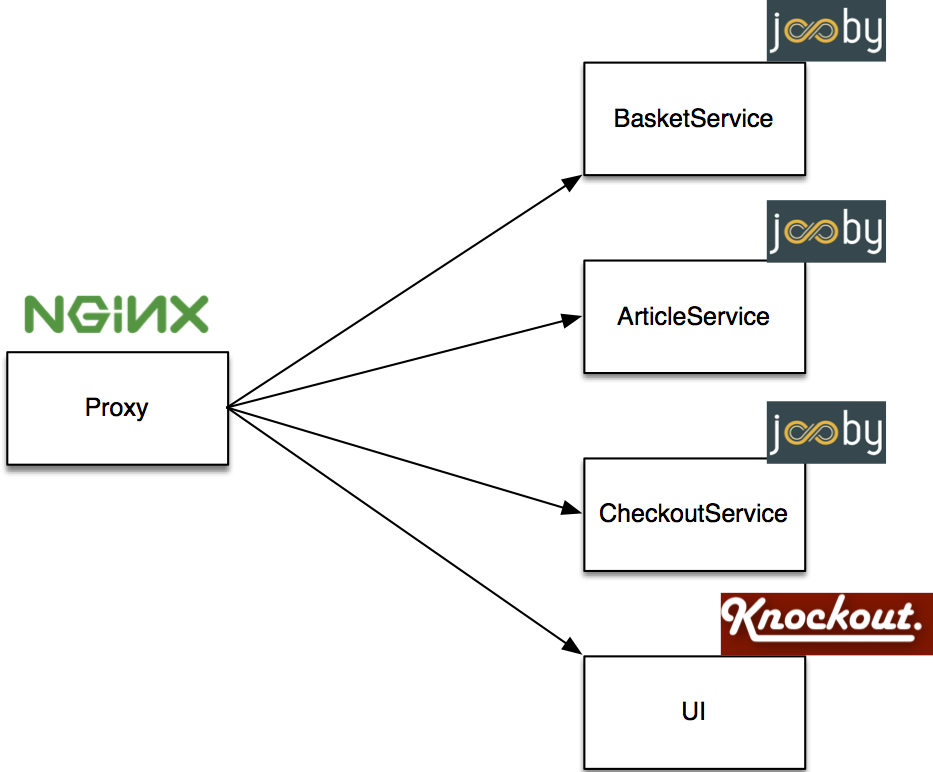

# Abstract
## Deutsch
Mesos, DC/OS und das moderne Datacenter - µServices erfolgreich in Produktion betreiben

Um den wachsenden Daten- und Usermengen begegnen zu können, verändert sich die Architektur von Anwendungen aktuell sehr stark. Eine Anwendung besteht immer häufiger aus vielen kleinen Services, welche verteilt und in Container verpackt sind. Verteilte Systeme hingegen unterliegen anderen Regeln als klassische monolithische Anwendungen. Insbesondere im Bereich Service-Discovery, Load-Balancing und Networking entstehen Herausforderungen für das moderne Datacenter. Um diese Probleme zu minimieren, abstrahieren DC/OS und Mesos die Komplexität von verteilten Systemen und etabliert sich dadurch als Cluster-Manager vieler großer Anwendungen.
In dieser Session wird Johannes die Idee und Vorgehensweise von Apache Mesos erläuteren, DC/OS (Datacenter Operating System) vorstellen und im Zuge einer Demo viele coole Features am lebenden Objekt zeigen. Insbesondere wird dabei auf Best Practices im Bereich Microservices eingegangen.


## English
Mesos and the Architecture of the New Datacenter - Operating µServices successfully in production

The architecture of applications have changed rapidly to face the growing amount of users and data. Applications are separated to smaller, containerized, distributed and collaborating services which should scale independently. Distributed systems rely on different rules than classical monolithic applications. To minimize this problems, Mesos abstracts the complexity of distributed systems and is established as cluster manager for many big applications.
In this session Johannes will show the idea and approach of cluster resource offerings build with Apache Mesos, they will introduce DC/OS (datacenter operating system) which is build on top of Mesos and show all the awesome features live during a huge Demo. He will also talk about best practices operating micro services.

# Talk

To see the presentation, just open the pdf file in the presentation folder or go to https://speakerdeck.com/unterstein/dcos-microservices

# What is in this demo?
- Three services, bundled together with docker-compose
- A web app consuming this services, serving static html files
- One proxy to get all services together


# Get this demo working locally
- You need mvn, java, docker and docker-compose to be installed on your machine.
- Go to sources and run this command

```
./build.sh && ./run.sh
```

- Point a browser of your choice to your docker ip on port ```8080``` for http to view the web app.

# Get this demo working on DC/OS
- You need a running DC/OS cluster to run this demo
- You have multiple options to spin up a DC/OS cluster
	- Go to https://dcos.io/ and to walk through the possibilities or browse the docs
	- Go to https://github.com/dcos/dcos-vagrant if you want to play around on your local box


# What was shown in demo
- DC/OS Dashboard
- Service UI: Simple sleep task, including constraints
- Show marathon-configuration.json
- CLI: `dcos marathon group add marathon-configuration.json`
- DC/OS Universe, install `marathon-lb`
- Look what happens in Service UI, show AppDefinition, logging, ...
- CLI: `dcos task log $taskId`
- CLI: `dcos marathon app update demo/webservice instances=20`
- Service UI: Change `"VERSION":"4"` and see rolling update
- Toggle health check `curl -XPUT your.public.elb.amazonaws.com/checkout/health` and see marathon will replace the task


